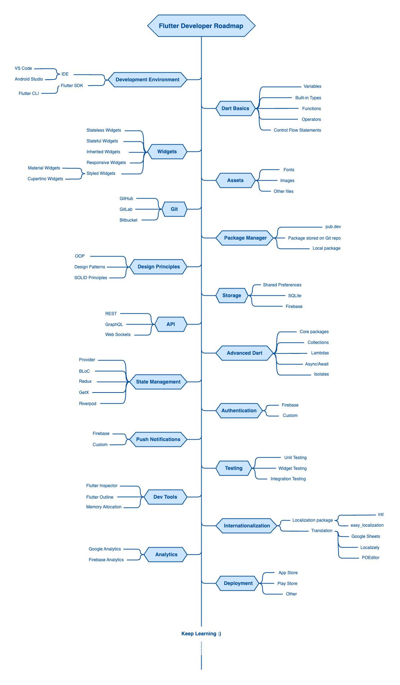

# Flutter Developer Roadmap (2024)

Welcome to the Flutter Developer Roadmap!

This guide is designed to illustrate the potential paths you can take, along with the packages and tools that are essential for those aspiring to become Flutter developers. This roadmap was created in response to the frequent question, "What should I learn next as a Flutter developer?".

## Purpose

The purpose of this roadmap is to offer a broad perspective on Flutter and its surrounding ecosystem, pinpointing the packages and tools every Flutter developer should know. It's designed to act as a beacon for those moments when you're pondering your next learning milestone. Be aware that each package and tool comes with its own set of pros and cons; there isn't a one-size-fits-all approach to selecting the right one. It's crucial for you to engage in critical thinking and determine which option aligns best with your needs and goals.

## Roadmap

## Feedback

If you find this roadmap valuable and helpful, please consider giving it a star. Your support is greatly appreciated and motivates me to continuously refine and enhance this resource.

Thank you for joining me on this Flutter development journey!
